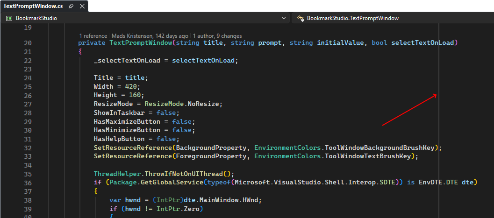
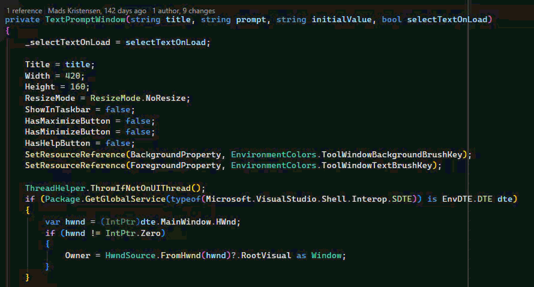

[repo]: <https://github.com/madskristensen/MaxLineLength>

# Max Line Length for Visual Studio

[](https://github.com/madskristensen/MaxLineLength/actions/workflows/build.yaml)
[](https://github.com/sponsors/madskristensen)

----

**See and apply your project's preferred line length directly in Visual Studio.** Max Line Length reads the effective `max_line_length` value from `.editorconfig`, displays a subtle ruler, and safely reflows supported content during **Format Document**, **Format Selection**, and Code Cleanup.

> This extension was inspired by the Visual Studio Developer Community feature request [Support `max_line_length` in EditorConfig](https://developercommunity.visualstudio.com/t/Support-max_line_length-in-editorconfig/567214).



## Why Max Line Length

| Need | What the extension provides |
| ---- | --------------------------- |
| Keep code readable | A clear visual boundary at the team's preferred line length |
| Apply the convention | Reflow supported content through Visual Studio's format and Code Cleanup commands |
| Share conventions | Configuration through the repository's existing `.editorconfig` file |
| Support mixed codebases | Per-file values resolved by Visual Studio from matching EditorConfig sections |
| Stay out of the way | No custom commands, options pages, or background scans |

## Getting started

Add `max_line_length` to a matching section in `.editorconfig`:

```ini
[*.{cs,vb}]
max_line_length = 120
```

Open a matching file in Visual Studio. The extension displays a vertical ruler immediately after column 120. Nested `.editorconfig` files and more specific sections work normally because Visual Studio resolves the effective setting for each document.

Change the value and save `.editorconfig` to update the convention. All open document rulers independently resolve their effective setting and move to the applicable column. Remove the property, set it to `unset`, or use an invalid value to hide the ruler and disable reflow.

Run **Format Document** or **Format Selection** to apply the configured limit. Plain-text documents wrap at the last whitespace before the limit and preserve indentation.

To use reflow with Code Cleanup, open **Configure Code Cleanup**, edit a profile, and enable **Reflow lines to configured maximum length**. The fixer is disabled by default so existing cleanup profiles do not change unexpectedly. Once enabled, it runs for document cleanup and cleanup on save. Project and solution cleanup are not supported.



*Executing the Format Document (Ctrl+K+D) command, the code is being reflowed.*

## Behavior

- Works with plain text, Markdown, C#, Visual Basic, F#, JavaScript, TypeScript, C++, CSS, LESS, SCSS, and SQL editors and uses the effective setting for each file.
- Honors `indent_size`, `indent_style`, and `tab_width` when calculating visual columns.
- Follows editor scrolling, zoom, font, and viewport changes.
- Stays hidden in diff views.
- Uses the editor foreground color with reduced opacity so it fits light, dark, and high-contrast themes.
- Groups built-in formatting and reflow into a single undo transaction.
- Provides an opt-in Code Cleanup profile item for document cleanup and cleanup on save.
- Restricts **Format Selection** reflow to complete selected lines or complete C# or Visual Basic syntax constructs.
- Reflows C# lists, fluent invocation chains, logical and null-coalescing expressions, conditional expressions, LINQ query clauses, and line comments.
- Reflows Visual Basic argument, parameter, type, initializer, and tuple lists plus line and documentation comments.
- Leaves C# and Visual Basic string and character literals unchanged because inserting raw newlines would produce invalid or semantically different code.
- Reflows classified comments only in F#, JavaScript, TypeScript, C++, CSS, LESS, SCSS, and SQL; executable expressions remain unchanged.
- Reflows ordinary Markdown paragraphs but leaves front matter, headings, lists, block quotes, tables, fenced or indented code, inline code, HTML, and hard line breaks unchanged.
- Does not intercept mouse or keyboard input.

## Profiling

The `ProcessesRepresentativeFormattingWorkload` test exercises the plain-text, Markdown, classified-comment, and C# reflow engines with representative document sizes. Filter on `Category=Profiling` when targeting this workload with a CPU or allocation profiler. It isolates the formatting algorithms; profile an experimental Visual Studio instance to measure editor, command-routing, and adornment overhead.

## Get involved

Found a bug or have an idea? Open an issue or pull request on the [GitHub repository][repo].